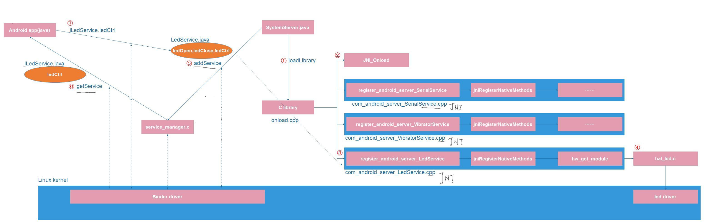

# Android核心

## Binder系统

[Android Binder系统分析](./binder)

## JNI原理

JAVA里面调用System.loadLibrary会导致C库里的JNI_OnLoad函数被调用

在JNI_OnLoad里将java里类方法hello和C库里的本地函数c_hello进行映射

	static const JNINativeMethod methods[] = {
		{"hello", "()V", (void *)c_hello},
	};

最终实现了JAVA里调用相应的类方法就调用到了C库里的函数

编译java代码

	javac JNIDemo.java

编译c库

	gcc -I/opt/java-7-openjdk-amd64/include/ -fPIC -shared -o libnative.so native.c

设置库文件链接地址

	export LD_LIBRARY_PATH=.

测试程序

	java JNIDemo

## Android中app调用底层驱动流程

1. SystemServer调用loadLibrary调用c库
2. c库被掉用导致c库中的JNI_Onload被调用
3. 在JNI_OnLoad函数里注册本地方法(映射java类方法和c函数)
4. 本地方法中将复杂的硬件操作放在HAL层实现
5. SystemServer通过addService向service_manager注册服务
6. android应用程序通过getService获得服务接口
7. 应用程序通过获得的服务接口来调用本地方法从而操作底层硬件

## Android中JNI调用HAL

JNI向上提供本地函数,向下加载HAL层库文件并调用HAL层函数

android5.1 JNI代码路径为frameworks/base/services/core/jni

HAL负责访问驱动程序执行硬件操作

android5.1 HAL层代码路径为hardware/libhardware/modules

JNI和HAL层代码都是使用C/C++编写的,JNI调用HAL层库文件本质就是动态库编程

android中将这个动态库编程封装为hw_get_module

### JNI怎么怎么使用HAL

调用hw_get_module获得一个hw_module_t结构体

	hw_get_module("led", (hw_module_t const**)&module);

调用hw_module_t结构体里的open函数来获得一个hw_device_t结构体,每个module可以包含多个device

	module->methods->open(module, NULL, &device);

把hw_device_t转换为设备自定义的结构体(设备自定义结构体第一个成员是hw_device_t)

	led_device = (led_device_t *)device;

其中自定义结构体如下

	struct led_device_t {
		struct hw_device_t common; /* 第一个成员是hw_device_t方便转化为hw_device_t */

		int (*led_open)(void);
		int (*led_ctrl)(int which, int status);
	};

### HAL层怎么写

实现一个名为HMI的hw_module_t结构体

	struct hw_module_t HAL_MODULE_INFO_SYM = {
		.tag = HARDWARE_MODULE_TAG,
		.id = LED_HARDWARE_MODULE_ID,
		.methods = &led_module_methods,
	};

实现一个open函数,它根据名字返回一个设备自定义的结构体

	static struct hw_module_methods_t led_module_methods = {
		.open = led_device_open,
	};

	static int led_device_open(const struct hw_module_t* module, const char* id, struct hw_device_t** device)
	{
		*device = &led_dev;
		return 0;
	}

## APK签名

[参考文章 APK使用系统签名](https://www.jianshu.com/p/63d699cffa1a)

- 找到平台签名文件"platform.pk8"和"platform.x509.pem",文件位置android/build/target/product/security/
- 签名工具"signapk.jar"在android/prebuilts/sdk/tools/lib
- 签名证书"platform.pk8" "platform.x509.pem",签名工具"signapk.jar"放置在同一个文件夹
- 执行如下命令
	java -jar signapk.jar platform.x509.pem platform.pk8 Demo.apk signedDemo.apk

或者直接在编译环境执行

	java -jar out/host/linux-x86/framework/signapk.jar build/target/product/security/platform.x509.pem build/target/product/security/platform.pk8 input.apk output.apk

## userdata image

查看分区中userdata大小,这个应该可以通过分区表来决定,在编译的时候获取到

	cat /proc/partitions

	major minor  #blocks  name
	254        0     520912 zram0
	179        0   15388672 mmcblk0
	179        1       4096 mmcblk0p1
	179        2       4096 mmcblk0p2
	179        3      65536 mmcblk0p3
	179        4      65536 mmcblk0p4
	179        5      20480 mmcblk0p5
	179        6     614400 mmcblk0p6
	179        7       4096 mmcblk0p7
	179        8    1089536 mmcblk0p8
	179        9      16384 mmcblk0p9
	179       10    1048576 mmcblk0p10
	179       11      65536 mmcblk0p11
	179       12       4096 mmcblk0p12
	179       13       4096 mmcblk0p13
	179       14      16384 mmcblk0p14
	179       15   12357632 mmcblk0p15
	179       32       4096 mmcblk0rpmb

其中userdata分区对应关系如下

	lrwxrwxrwx root     root              2013-01-23 17:59 userdata -> /dev/block/mmcblk0p15

mmcblk0即emmc的容量(单位kb)

	12357632 * 1024 = 12654215168

修改device/rockchip/rk3288/BoardConfig.mk里添加如下

	BOARD_USERDATAIMAGE_PARTITION_SIZE=12654215168

编译userdata

	make userdataimage

## BootChart

### 制作bootchart

[参考文章 Android bootchart的使用](http://blog.csdn.net/qqxiaoqiang1573/article/details/56839031)

设备上操作

	echo 120 > /data/bootchart/start
	tar -czf bootchart.tgz header proc_stat.log proc_ps.log proc_diskstats.log kernel_pacct

PC机上操作

	bootchart bootchart.tgz

### 比较两次开机bootchart

将前后两次bootchart.tgz拷贝到boot_bootchart_dir和exp_bootchart_dir目录下

	ls base_bootchart_dir exp_bootchart_dir
	base_bootchart_dir:
	bootchart.tgz

	exp_bootchart_dir:
	bootchart.tgz

执行[compare-bootcharts.py](./compare-bootcharts.py)脚本,得到对比结果,其中添加一个名为user_specify_process的进程

	$ ./compare-bootcharts.py base_bootchart_dir exp_bootchart_dir

## KeyEvent and KeyLayout

内核中KeyLayout文件(device/rockchip/common/rk29-keypad.kl)内容如下

	key 59    MENU
	key 102   HOME
	key 114   VOLUME_DOWN
	key 115   VOLUME_UP
	key 116   POWER
	key 143   WAKEUP
	key 158   BACK
	key 212   CAMERA
	key 217   SEARCH

获取按键事件值(0x74对应的116)POWER

	getevent  /dev/input/event3

	0001 0074 00000001
	0000 0000 00000000
	0001 0074 00000000
	0000 0000 00000000

内核中POWER对应的android的键值KEYCODE_POWER

	input  keyevent KEYCODE_POWER        //26

## 命令行操作执行OTA升级

将生成的ota包放到/cache/update.zip后执行如下命令

	echo -e "--update_package=CACHE:update.zip" > /cache/recovery/command
	reboot recovery

### OTA差分包制作

发布pre版本的固件,生成pre版本的ota完整包

	make otapackage

保存pre版本的基础素材

	cp out/target/product/rk3288/obj/PACKAGING/target_files_intermediates/rk3288-target_files-user.gentoo.20171009.110038.zip target_files-pre.zip

修改代码...

发布cur版本的固件,生成cur版本的ota完整包

	make otapackage

保存cur版本的基础素材

	cp out/target/product/rk3288/obj/PACKAGING/target_files_intermediates/rk3288-target_files-user.gentoo.20171009.112455.zip target_files-cur.zip

生成pre和cur的差异升级包

./build/tools/releasetools/ota_from_target_files -v -i rk3288-target_files-pre.zip -p out/host/linux-x86 -k build/target/product/security/testkey rk3288-target_files-cur.zip out/target/product/rk3288/rk3288_OTA_DIFF.zip

将rk3288_OTA_DIFF.zip放到/cache/update_diff.zip后执行如下命令

	echo -e "--update_package=CACHE:update_diff.zip" > /cache/recovery/command
	reboot recovery

## 使用am命令启动apk

首先用下面这个命令查出APK名字

	dumpsys window w | grep \/ | grep name=

比如现在打开摄像头apk后

	dumpsys window w | grep \/ | grep name=

输出结果如下

	mSurface=Surface(name=com.android.camera2/com.android.camera.CameraActivity)

以后就可以用adb来启动这个apk

	am start -n com.android.camera2/com.android.camera.CameraActivity
