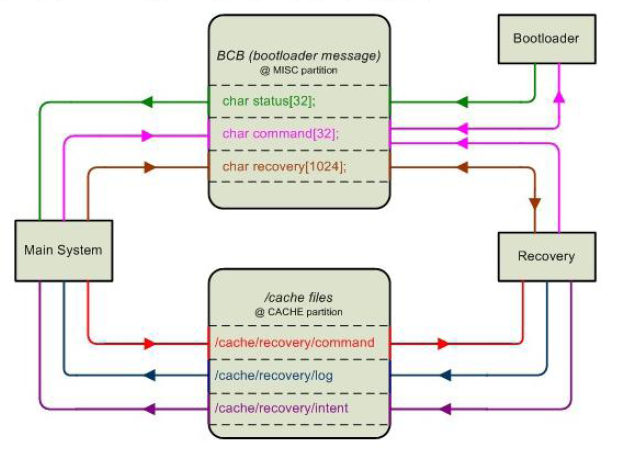

# Recovery和OTA升级流程

[参考文章: OTA制作及升级过程笔记](https://blog.csdn.net/teliduxing1029/article/details/51536560)

[参考文档: Rockchip Recovery OTA用户操作指南V1.01](./rockchip_recovery_ota.pdf)

## Android Recovery三个部分两个接口

三个部分
- main system : 用boot.img启动linux系统,android的正常工作模式
- recovery : 用recovery.img启动linux系统,主要是运行recovery程序
- bootloader : 除了加载,启动系统,还会通过读取misc分区来获取main
  system和recovery的消息,并决定做和操作

两个通信接口
- /cache/recovery/ : command, log, intent
- BCB(Bootloader Control Block) : misc分区(占用三个page,其本身就是一个结构体)

具体成员以及各成员含义如下

- command字段

该字段的值会在Android系统需要进入recovery模式的时候被更新
另外在固件更新成功时,也会被更新,以进入recovery
模式来做一些收尾的清理工作.在更新成功后结束
Recovery时,会清除这个字段的值,防止重启时再次进入Recovery模式

- status字段

在完成"update-radio"或者"update-hboot"更新后,bootloader会将执行结果写入到这个字段

- recovery字段

仅可以被 Main System写入,用来向 recovery发送消息

以上三个部分通信流程图



## OTA包制作过程分析

编译OTA整包命令

	make otapackage

build/core/Makefile中定义如下
```make
INTERNAL_OTA_PACKAGE_TARGET := $(PRODUCT_OUT)/$(name).zip

$(INTERNAL_OTA_PACKAGE_TARGET): KEY_CERT_PAIR := $(DEFAULT_KEY_CERT_PAIR)

$(INTERNAL_OTA_PACKAGE_TARGET): $(BUILT_TARGET_FILES_PACKAGE) $(DISTTOOLS)
	@echo "Package OTA: $@"
	$(hide) PATH=$(foreach p,$(INTERNAL_USERIMAGES_BINARY_PATHS),$(p):)$$PATH
MKBOOTIMG=$(MKBOOTIMG) \
	   ./build/tools/releasetools/ota_from_target_files -v \
	   -p $(HOST_OUT) \
	   -k $(KEY_CERT_PAIR) \
	   $(if $(OEM_OTA_CONFIG), -o $(OEM_OTA_CONFIG)) \
	   $(BUILT_TARGET_FILES_PACKAGE) $@

.PHONY: otapackage
otapackage: $(INTERNAL_OTA_PACKAGE_TARGET)
```
可知otapackage依赖是INTERNAL_OTA_PACKAGE_TARGET

INTERNAL_OTA_PACKAGE_TARGET依赖是KEY和BUILT_TARGET_FILES_PACKAGE, DISTTOOLS

DISTTOOLS依赖是一些工具和库文件
```make
DISTTOOLS :=  $(HOST_OUT_EXECUTABLES)/minigzip \
  $(HOST_OUT_EXECUTABLES)/mkbootfs \
  $(HOST_OUT_EXECUTABLES)/mkbootimg \
  $(HOST_OUT_EXECUTABLES)/fs_config \
  $(HOST_OUT_EXECUTABLES)/zipalign \
  $(HOST_OUT_EXECUTABLES)/bsdiff \
  $(HOST_OUT_EXECUTABLES)/imgdiff \
	...

DISTTOOLS += \
  $(HOST_LIBRARY_PATH)/libc++$(HOST_SHLIB_SUFFIX) \
  $(HOST_LIBRARY_PATH)/liblog$(HOST_SHLIB_SUFFIX) \
  $(HOST_LIBRARY_PATH)/libcutils$(HOST_SHLIB_SUFFIX) \
	...
```
BUILT_TARGET_FILES_PACKAGE的目的是编译出所有资源包并将其打包zip文件

### 资源包ziproot

zip_root路径

	out/target/product/<product-name>/obj/PACKAGING/target_files_from_intermedias/<product-name>-target_files-<version-name>

经过目标文件BUILT_TARGE_FILES_PACKAGE的执行后 system.img已经被重新打包
且差分资源包也已经生成,剩下的工作就是将差分资源包(即target-files zipfile,下文将统一使用"差分资源包"这一概念)
最终将资源包传递给ota_from_target_files代码,由它来生成OTA整包

上面所做的所有操作作用就在于将系统资源(包括system,recovery,boot等目录)重新打包,生成差分资源包.我们可以看下差分资源包中的文件结构如下(各个平台有些小差异)

	BOOT  DATA  LOADER  META  OTA  PARAMETER  RECOVERY  SYSTEM

### 打包OTA资源包

工具目录

	build/tools/releasetools

edify_generator.py

	是用于生成recovery模式下升级的脚本文件:<升级包>.zip/META-INF/com/google/android/updater-script

ota_from_target_files

	WriteFullOTAPackage 用于生成整包
	WriteIncrementalOTAPackage 用来生成差分包

WriteFullOTAPackage

	将OTA/bin/updater添加到升级包中:<升级包>.zip/META-INF/com/google/android/update-binary
	通过操作script对象来生成升级包中的脚本文件:<升级包>.zip/META-INF/com/google/android/updater-script
	将system目录,boot.img等文件添加到整包中

## Recovery升级操作

recovery中升级操作流程
执行update-binary,其中会根据脚本updater-script来执行

### updater-script

updater-script的生成流程(build/core/Makefile)

```make
$(INTERNAL_OTA_PACKAGE_TARGET): $(BUILT_TARGET_FILES_PACKAGE) $(DISTTOOLS)
    @echo "Package OTA: $@"
    $(hide) PATH=$(foreach p,$(INTERNAL_USERIMAGES_BINARY_PATHS),$(p):)$$PATH
MKBOOTIMG=$(MKBOOTIMG) \
       ./build/tools/releasetools/ota_from_target_files -v \
       -p $(HOST_OUT) \
       -k $(KEY_CERT_PAIR) \
       $(if $(OEM_OTA_CONFIG), -o $(OEM_OTA_CONFIG)) \
       $(BUILT_TARGET_FILES_PACKAGE) $@

.PHONY: otapackage
otapackage: $(INTERNAL_OTA_PACKAGE_TARGET)
```
Makefile中会调用ota_from_target_files来生成相关文件

在ota_from_target_files脚本中尝试读入releasetools.py文件(这个文件是vendor的)
如果平台有相关文件就用平台提供的,无的话就用android原生目录下的工具
```python
if OPTIONS.device_specific is None:
from_input = os.path.join(OPTIONS.input_tmp, "META", "releasetools.py")
if os.path.exists(from_input):
  print "(using device-specific extensions from target_files)"
  OPTIONS.device_specific = from_input
else:
  OPTIONS.device_specific = OPTIONS.info_dict.get("tool_extensions", None)
```

其中updater-script脚本内容大致如下

	getprop("ro.product.device")
	package_extract_dir("system", "/system");
	write_raw_image(package_extract_file("boot.img"), "boot");
	ui_print("end update parameter");

其对应的函数位于bootable/recovery/updater/install.c

通过RegisterFunction来注册的函数

    RegisterFunction("mount", MountFn);
    RegisterFunction("symlink", SymlinkFn);
    RegisterFunction("write_raw_image", WriteRawImageFn);

### update-binary

update-binary代码路径

	bootable/recovery/updater

编译出来的updater将放入到out/target/product/<product-name>/obj/EXECUTABLES/updater_intermediates

build/core/Makefile中会将该updater拷贝到制定目录

	built_ota_tools := \
		$(call intermediates-dir-for,EXECUTABLES,updater,,,$(TARGET_PREFER_32_BIT))/updater

recovery执行update-binary代码调用流程

	main	//bootable/recovery/recovery.cpp
		install_package	//bootable/recovery/install.cpp
			really_install_package(path, wipe_cache, needs_mount);
				mzOpenZipArchive(map.addr, map.length, &zip);
				try_update_binary(really_path, &zip, wipe_cache);
					创建一个子进程来执行update-binary

### 打包update-binary和updater-script

build/tools/releasetools/edify_generator.py中将打包update-binary和updater-script到zip文件中

```python
def AddToZip(self, input_zip, output_zip, input_path=None):
"""Write the accumulated script to the output_zip file.  input_zip
is used as the source for the 'updater' binary needed to run
script.  If input_path is not None, it will be used as a local
path for the binary instead of input_zip."""

self.UnmountAll()

common.ZipWriteStr(output_zip, "META-INF/com/google/android/updater-script",
				   "\n".join(self.script) + "\n")

if input_path is None:
  data = input_zip.read("OTA/bin/updater")
else:
  data = open(input_path, "rb").read()
common.ZipWriteStr(output_zip, "META-INF/com/google/android/update-binary",
				   data, perms=0o755)
```
## 自定义更新文件

以RK为例,需要更新RK的Loader和parameter文件

受限在build/core/Makefile中定义自定义的文件

	INSTALLED_LOADER_MISC_TARGET := $(TARGET_DEVICE_DIR)/ota/loader/misc_loadercmd.img
	INSTALLED_LOADER_TARGET := $(strip $(wildcard $(TARGET_DEVICE_DIR)/ota/loader/RK*Loader*.bin))
	INSTALLED_NEW_LOADER_TARGET := $(PRODUCT_OUT)/RKLoader_new.bin
	INSTALLED_PARAMETER_TARGET := $(strip $(wildcard $(TARGET_DEVICE_DIR)/ota/parameter/parameter*))

将该自定义文件添加到targetfile中

	$(BUILT_TARGET_FILES_PACKAGE): \
			$(INSTALLED_LOADER_TARGET) \
			$(INSTALLED_PARAMETER_TARGET) \

将文件拷贝到zip_root下
```make
ifeq ($(INSTALLED_LOADER_TARGET),)
	$(info No RK Loader for TARGET_DEVICE $(TARGET_DEVICE) to otapackage)
else
	@# Contents of the rk loader bin
	$(hide) mkdir -p $(zip_root)/LOADER
	$(hide) $(HOST_OUT_EXECUTABLES)/remkloader '$(INSTALLED_LOADER_TARGET)'
$(INSTALLED_NEW_LOADER_TARGET)
	$(hide) cat $(INSTALLED_LOADER_MISC_TARGET) $(INSTALLED_NEW_LOADER_TARGET) >
$(zip_root)/LOADER/RKLoader.img
endif
ifeq ($(INSTALLED_PARAMETER_TARGET),)
	$(info No parameter for TARGET_DEVICE $(TARGET_DEVICE) to otapackage)
else
	$(hide) rm -rf $(zip_root)/PARAMETER
	$(hide) mkdir -p $(zip_root)/PARAMETER
	$(hide) $(HOST_OUT_EXECUTABLES)/mkparameter '$(INSTALLED_PARAMETER_TARGET)'
$(zip_root)/PARAMETER/parameter
endif
```

这样在编译出来的目录就会有相应的文件,使用自定义的脚本操作

	$(hide) if test -e $(tool_extensions)/releasetools.py; then $(ACP) $(tool_extensions)/releasetools.py $(zip_root)/META/; fi


该脚本由RK提供在目录device/rockchip/common/releasetools.py
```make
ifeq ($(TARGET_RELEASETOOLS_EXTENSIONS),)
# default to common dir for device vendor
$(BUILT_TARGET_FILES_PACKAGE): tool_extensions := $(TARGET_DEVICE_DIR)/../common
else
$(BUILT_TARGET_FILES_PACKAGE): tool_extensions :=
$(TARGET_RELEASETOOLS_EXTENSIONS)
endif
```
通过脚本中下面两个函数来生成相应脚本
```python
def Install_Parameter(info):
  try:
	parameter_bin = info.input_zip.read("PARAMETER/parameter");
  except KeyError:
	print "warning: no parameter in input target_files; not flashing parameter"
	return

  print "find parameter, should add to package"
  common.ZipWriteStr(info.output_zip, "parameter", parameter_bin)
  info.script.Print("start update parameter...")
  info.script.WriteRawParameterImage("/parameter", "parameter")
  info.script.Print("end update parameter")

def InstallRKLoader(loader_bin, input_zip, info):
  common.ZipWriteStr(info.output_zip, "RKLoader.img", loader_bin)
  info.script.Print("Writing rk loader bin...")
  info.script.WriteRawImage("/misc", "RKLoader.img")
```
对应脚本中内容如下

	write_raw_image(package_extract_file("RKLoader.img"), "misc");// 将loader写入misc分区
	write_raw_parameter_image(package_extract_file("parameter"), "parameter");
